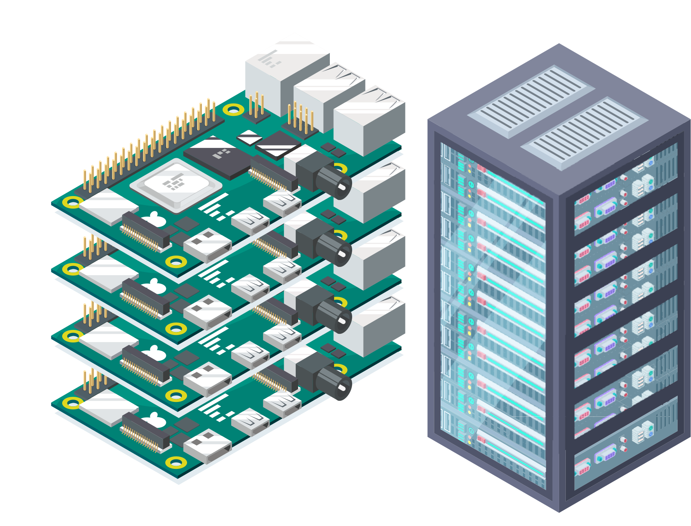

  

<p align="center">
  <a href="https://github.com/jessestuart/tiller-multiarch">
    
  </a>
</p>

# Mini-Homelab Helm Charts
Homelab Helm Charts compatible with ARM64 and ARM Docker Images.

Helm charts I've put together to quickly get up and running with the most popular homelab applications with the intension to run them on a Raspberry Pi k3s cluster.


## Installation

```console
# Add Helm Repo
helm repo add edward8e https://edward8e.github.io/mini-homelab/

# Update Repo list
helm repo update

# Install/Upgrade chart
helm upgrade -i sonarr edward8e/sonarr -f values.yaml

# List Charts
helm search repo edward8e

# Get values.yaml
helm show values edward8e/sonarr > values.yaml
```


### Applications:
- Radarr
- Sonarr
- Lidarr
- Readarr
- Overseerr
- Bazarr
- Jackett (develop)
- qBittorrent (develop)
- Wireguard (develop)
- Gluetun (develop)
- Homer
- Mealie
- Uptime Kuma
- Forwarder (custom) (develop)


### Testing on:
- Nodes: 4
- Kubernetes: k3s v1.22.6
- Hardware: Raspberry Pi 4 8gbs ram
- OS: Raspbian 64bit

